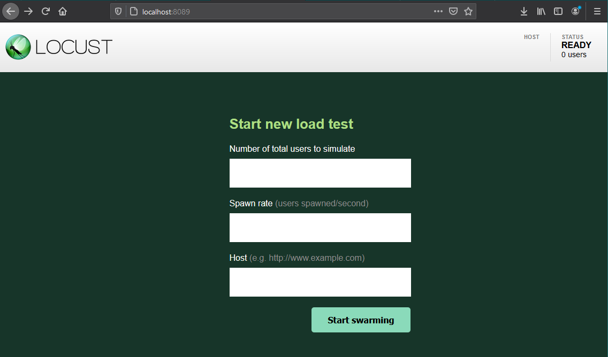
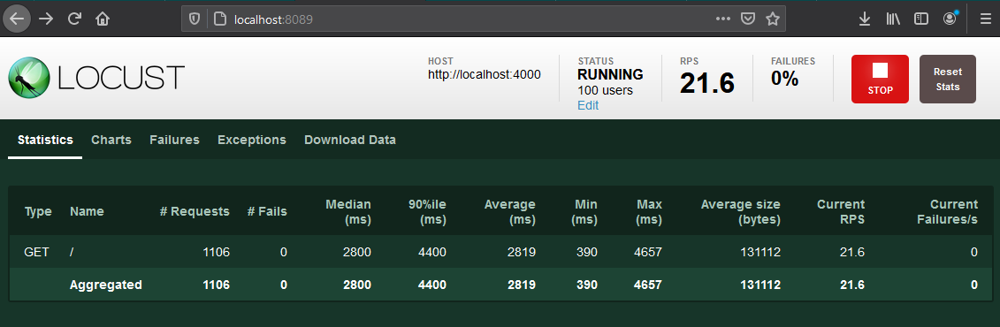
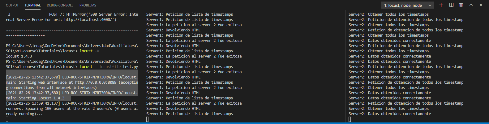
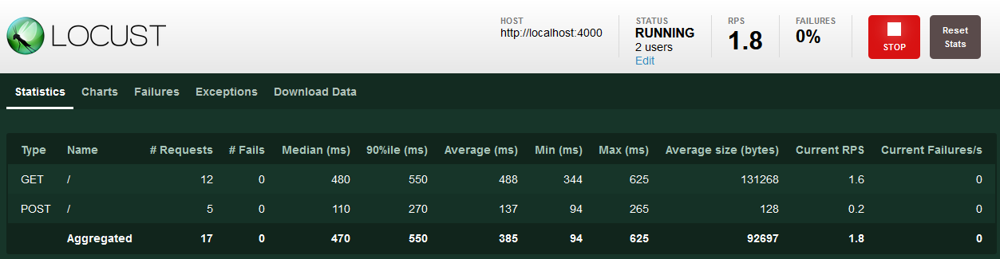
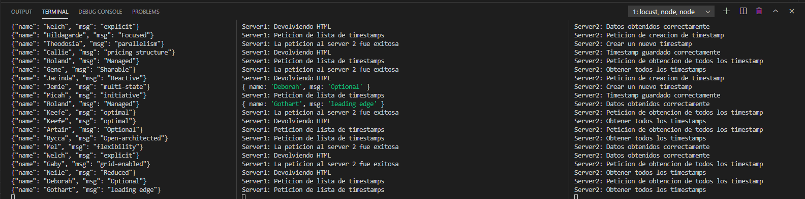
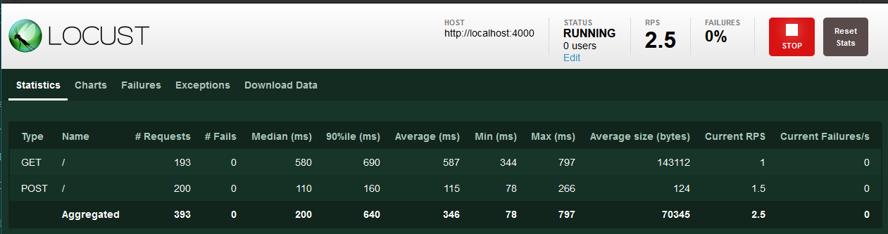
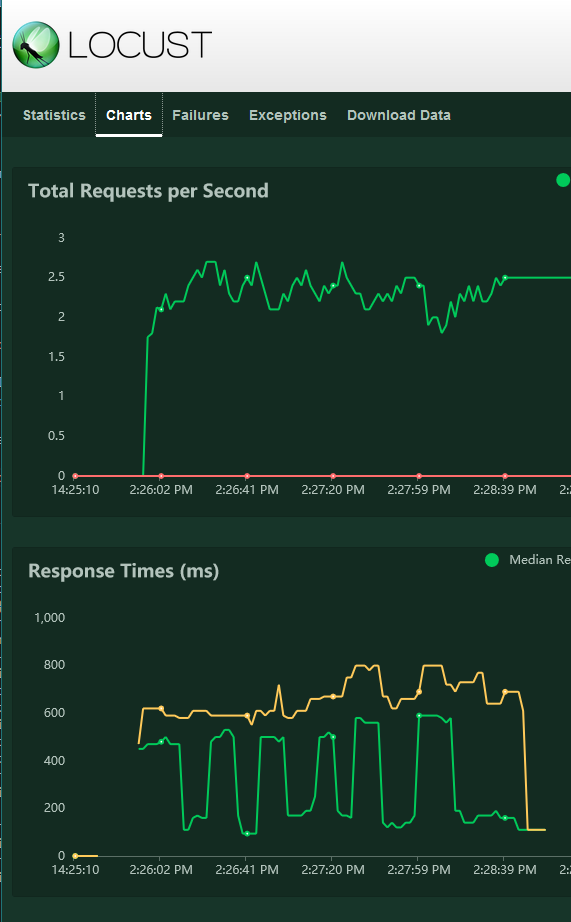

# LOAD TESTING

Ya que tenemos configurados nuestros servicios, como vimos en la clase 3 y 4, es momento de ponerlos a prueba. Una de las formas de poner a prueba una API es por medio de un tipo de pruebas no-funcionales conocidas como _Load Testing_.

Load testing se refiere a cualquier proceso que ponga a prueba la forma en la que (en este caso) nuestra API responda al tráfico enviado. En este curso lo utilizamos para poner a prueba nuestros balanceadores de carga, ¡De lo contrario deberíamos hacer cientos de peticiones por nosotros mismos!

Para realizar nuestro Load Testing, utilizaremos una herramienta llamada Locust, es un framework utilizado para load testing de Python; nos provee de una interfaz para realizar pruebas, y aunque en este curso la utilizaremos para generar tráfico únicamente, también puede realizar muchas otras funciones, todas orientadas a poner a prueba la capacidad de tu arquitectura.

# Locust

Locust tiene como base una librería realizada en Python (aunque la mayoría de su código base está escrita en él). Sin embargo también nos puede ofrecer una app web local, donde podemos realizar nuestras pruebas y tener acceso a configuraciones como la cantidad de _usuarios_ que se generarán, la cadencia a la que se generarán estos usuarios y el URL a donde irán dirigidas estas peticiones.

## Instalando locust

Para instalar Locust es necesario tener **Python 3.6+**; si por alguna razón aún tienes Python 2.x puedes usar Docker para tener dentro de un contenedor Python y trabajar dentro de él. Utilizaremos pip3 (un _controlador de paquetes de python_) para instalar Locust, con el siguiente comando en la terminal (en el directorio donde deseamos realizar nuestro código)

```bash
$ pip3 install locust
```

Este comando nos descargará locust, y para comprobar que sea así, podemos confirmar la versión que estamos utilizando con el comando

```bash
$ locust -V
# en mi caso, esto da como resultado locust 1.4.3
```

Ahora que ya tenemos locust instalado, podemos iniciar a utilizarlo.

## Utilizando locust

En la misma carpeta donde instalaste Locust, crea un archivo llamado _traffic.py_, hay que notar que este nombre es totalmente arbitrario y únicamente lo llamé así para fines de ejemplo.

Ahora, necesitaremos importar algunos paquetes de python para hacer funcionar nuestras pruebas, iniciamos con un archivo más o menos de esta manera:

```Python
from locust import HttpUser, task, between

class UsuarioDeApi(HttpUser):
    @task
    def test(self):
        self.client.get('/')
```

Este código es lo mínimo que necesitamos para crear un archivo locust, obviamente no nos es suficiente esto para realizar lo que necesitamos, sin embargo con esto basta para seguir con la explicación.

Ahora que ya tenemos un archivo locust listo, podemos iniciar nuestro server de locust. Ejecutamos el siguiente comando:

```bash
# Recordemos que nuestro archivo se llama traffic.py, por ello lo mandamos como parametro
$ locust --locustfile traffic.py

# La salida esperada será algo así:

# [2021-02-25 13:42:37,670] LEO-ROG-STRIX-N7RT30RA/INFO/locust.main: Starting web interface at http://0.0.0.0:8089 (accepting connections from all network interfaces)
# [2021-02-25 13:42:37,680] LEO-ROG-STRIX-N7RT30RA/INFO/locust.main: Starting Locust 1.4.3
```

Como podemos darnos cuenta de la salida, locust abrió el puerto 8089, accederemos a él a través de un navegador.

Al ingresar a http://localhost:8089 nos aparece la siguiente pantalla:



En esta pantalla se nos presentan tres inputs, con los cuales controlaremos nuestro load testing.

### Number of total users to simulate

Este campo espera que ingresemos un número de 1 a N. Este número indicará cuantos "usuarios" de nuestra API generará Locust.

Al ingresar, por ejemplo, el valor _10_, locust nos creará en total 10 usuarios; **cada uno de ellos realizará lo que sea que hayamos escrito en nuestra clase _UsuarioDeApi_ que escribimos arriba.**

### Spawn rate (users spawned/second)

Esta es la frecuencia a la cual se crearán usuarios, pueden ser decimales incluso (si deseamos esperar algunos segundos entre cada usuario). Con este parámetro decidiremos qué tan rápido y cuántos usuarios queremos que estén por segundo en la prueba.

### Host

Este campo espera que ingresemos un URL válido (y sí, incluyendo el "http://"), acá podemos poner cualquier valor que contenga un URL válido.

## Utilizando Locust con nuestra API

Nuestro servicio de Locust por el momento puede servirnos para comprobar que podemos hacer un GET a nuestra API (que recordemos nos devuelve un HTMl con una lista de timestamps).

Así que podemos ingresar nuestra configuración:

_Nota: La API que probarémos está escuchando en http://localhost:4000_


Con esta configuración haremos lo siguiente:

- Indicamos a Locust que necesitamos **100 usuarios**
- Indicamos a Locust que nos agregue usuarios a razón de **2 usuarios por segundo**. Por lo tanto, tardaremos 50 segundos en llegar a 100 usuarios.
- Indicamos a Locust que la dirección a la que queremos realizar peticiones es http://localhost:4000, en nuestro caso esta es la URL de nuestra API.

Por último, ejecutamos Start Swarming (haciendo referencia al nombre de Locust, langosta en español).

Cuando iniciamos el proceso empiezan a ejecutarse las tareas que definimos en nuestro archivo traffic.py; en este caso únicamente tenemos una tarea que realiza una petición GET /.



En el encabezado de la página vemos cuántos usuarios tenemos generados hasta el momento (100 usuarios), también vemos las peticiones por segundo promedio (21.6).

También se nos muestra un botón de pausar la prueba, de reiniciar los stats que locust ha guardado hasta el momento. Si nuestra petición resulta en algún código de error HTTP (como 400 BAD REQUEST, 401 UNAUTHORIZED O 500 INTERNAL SERVER ERROR) entonces empezará a subir el porcentaje de failure.

En la tabla que tenemos en la tab statistics (la vista actual) podemos revisar cuales son las pruebas que estamos realizando, en este caso únicamente nuestro GET /. El total de peticiones que vamos haciendo hasta el momento, la cantidad de requests que resultaron en fallos, y algunos datos estadísticos del tiempo de respuesta en milisegundos. La cantidad de bytes que hemos recibido en promedio por petición, las peticiones por segundo promedio y por último los fallos por segundo promedio.

Se pueden visualizar reportes como gráficas de peticiones, el detalle de los fallidos, excepciones que han ocurrido en nuestro código (si ocurren fallos en nuestro código python Locust no parará), y por último exportar nuestros datos recopilados para futuro análisis.

En la consola donde estamos corriendo nuestras APIs podemos ver las siguientes salidas, de los logs que realizamos cada vez que hacemos una petición.



En la terminal de la izquierda, vemos a Locust ejecutandose. En la terminal de en medio tenemos nuestro server 1 que lee el timestamp desde el módulo kernel, y en la terminal de la derecha miramos nuestro server 2 que se conecta a MongoDB para almacenarlos.

## Ya nos sirve locust, ¿Ahora qué?

### Formato de traffic.json

Recordemos que nuestro objetivo es enviar tráfico desde un archivo, por lo cual necesitamos primero tener un archivo de datos. En nuestro caso le llamaremos traffic.json y dentro de él únicamente se tendrá un array en formato JSON, con la siguiente estructura:

```json
{
  "name": "Leonel Aguilar",
  "msg": "¡Hola Mundo!"
}
```

Tendremos un array de estos elementos, que conformarán parte de un sistema de mensajes. En el camino se le insertará a estos datos el timestamp donde se generó el mensaje.

Utilizando http://mockaroo.com, creamos 100 datos de prueba con el mismo formato, se puede ver este archivo en el folder 

**Guardaremos este archivo en el mismo folder donde tenemos nuestro programa traffic.py**

### Agregando la clase Reader

Necesitamos leer el archivo traffic.json, recordemos que esta lectura será en orden totalmente aleatorio, además no podemos leer de manera consecutiva debido a que no sabemos qué tantos usuarios tendremos, etc.

Por ello, programamos una pequeña clase que realiza esta tarea y validaciones por nosotros. El código de esta clase se encuentra a continuación:

```Python
# Esta clase nos ayudara a manejar todas las acciones de lectura de los datos del archivo
class Reader():

    # Constructor de la clase
    def __init__(self):
        self.file_path = "./traffic.json"
        # En esta variable almacenaremos nuestros datos
        self.array = []
        # En esta variable almacenaremos los indices que hemos recorrido
        self.read_index = []

    # Obtener un valor random del array
    # NOTA: ESTO QUITA EL VALOR DEL ARRAY.
    def pickRandom(self):
        # Obtenemos el numero de elementos del array
        length = len(self.array)

        # Si aun hay valores en el array
        if (length > 0):
            # Obtenemos un valor random desde 0 al largo del array - 1
            # Si el largo de nuestro arreglo es uno, entonces debemos de agarrar el ultimo indice posible, o sea 0.
            # De lo contrario, utilizaremos un valor al azar
            # Esta comparacion se hace debudo al error empty range for randrange() (0, 0, 0),
            # Al llegar a 1 en el largo, el rango de random se convierte en 0, 0; y hace fallar al programa
            random_index = randrange(0, length - 1) if length > 1 else 0

            # Devolvemos el valor que se encuentra en nuestro indice random
            # Quitamos el valor del array
            return self.array.pop(random_index)

        # Si ya no hay mas datos que leer del archivo
        else:
            # Imprimimos que ya no hay datos en el archivo
            print (">> Reader: No hay más valores para leer en el archivo.")
            # Retornamos nada
            return None

    # Cargar el archivo de datos json
    def load(self):
        # Mostramos en consola que estamos a punto de cargar los datos
        print (">> Reader: Iniciando con la carga de datos")
        # Ya que leeremos un archivo, es mejor realizar este proceso con un Try Except
        try:
            # Asignamos el valor del archivo traffic.json a la variable data_file
            with open("traffic.json", 'r') as data_file:
                # Con el valor que leemos de data_file vamos a cargar el array con los datos
                self.array = json.loads(data_file.read())
            # Mostramos en consola que hemos finalizado

            print (f'>> Reader: Datos cargados correctamente, {len(self.array)} datos -> {getsizeof(self.array)} bytes.')
        except Exception as e:
            # Imprimimos que no pudimos procesar la carga de datos
            print (f'>> Reader: No se cargaron los datos {e}')
```

El código de esta clase está totalmente documentado, por lo cual no lo explicaré más acá; sin embargo queiro notar que tenemos dos métodos cruciales, _load_ que se encargará de cargar el archivo traffic.json, y _pickRandom_ que nos devolverá un valor random que leeremos del arreglo traffic.json.

Ahora, necesitamos cambiar un poco nuestro código de Locust para que utilicemos esta clase que acabamos de programar:

```Python

# Esta clase es utilizada para crear una prueba de locust como tal
# Deriva de HTTP-User, simulando un usuario utilizando nuestra APP.
# En esta clase definimos todo lo que necesitamos hacer con locust.
class MessageTraffic(HttpUser):
    # Tiempo de espera entre peticiones
    # En este caso, esperara un tiempo de 0.1 segundos a 0.9 segundos (inclusivo)
    #  entre cada llamada HTTP
    wait_time = between(0.1, 0.9)

    # Este metodo se ejecutara cada vez que empecemos una prueba
    # Este metodo se ejecutara POR USUARIO (o sea, si definimos 3 usuarios, se ejecutara 3 veces y tendremos 3 archivos)
    def on_start(self):
        print (">> MessageTraffic: Iniciando el envio de tráfico")
        # Iniciaremos nuestra clase reader
        self.reader = Reader()
        # Cargaremos nuestro archivo de datos traffic.json
        self.reader.load()

    # Este es una de las tareas que se ejecutara cada vez que pase el tiempo wait_time
    # Realiza un POST a la dirección del host que especificamos en la página de locust
    # En este caso ejecutaremos una petición POST a nuestro host, enviándole uno de los mensajes que leimos
    @task
    def PostMessage(self):
        # Obtener uno de los valores que enviaremos
        random_data = self.reader.pickRandom()

        # Si nuestro lector de datos nos devuelve None, es momento de parar
        if (random_data is not None):
            # utilizamos la funcion json.dumps para convertir un objeto JSON de python
            # a uno que podemos enviar por la web (básicamente lo convertimos a String)
            data_to_send = json.dumps(random_data)
            # Imprimimos los datos que enviaremos
            printDebug (data_to_send)

            # Enviar los datos que acabamos de obtener
            self.client.post("/", json=random_data)

        # En este segmento paramos la ejecución del proceso de creación de tráfico
        else:
            print(">> MessageTraffic: Envio de tráfico finalizado, no hay más datos que enviar.")
            # Parar ejecucion del usuario
            self.stop(True) # Se envía True como parámetro para el valor "force", este fuerza a locust a parar el proceso inmediatamente.
```

Nuevamente el código de esta reestructuración está totalmente documentado, por lo cual únicamente debemos notar acá que definimos dentro de nuestra clase de prueba el método on_load, este método se realizará cada vez que **se carga un usuario**.

Ahora ya no realizamos solamente un GET sino también hacemos un POST para crear los mensajes que estamos leyendo del archivo traffic.json.

Por último, definimos una variable que se llama wait_time en la clase, esta define que tanto se debe esperar entre cada peticion (hacer un comportamiento un poco más aleatorio).

El código completo de el cambio se puede encontrar en .

Nuevamente volvemos a ejecutar nuestro comando para iniciar Locust

```bash
# Iniciamos un test de locust
$ locust --locustfile traffic.py
```

Volvemos a ingresar la misma configuración de antes (aunque yo le cambié a únicamente **2 usuarios**); nuestra vista ahora cambiará a tener dos filas en la tabla de tareas ejecutándose.



Ahora tenemos dos tareas, un POST y un GET dirigidos a la misma ruta /.

Al revisar nuestra consola de la API podemos notar los datos ingresando de manera consecutiva.



Una parte importante del cambio que debimos hacer a nuestro archivo traffic.py fue que se detuviera automáticamente cuando ya no existieran más peticiones por hacer, esto para **no repetir los datos por usuario**.

Por último podemos visualizar nuestro test finalizado, terminamos con las siguientes estadísticas:



Y con las graficas de peticiones en tiempo real:



### ¿Qué queda por hacer?

Una de las tareas que falta realizar en este módulo de load testing es configurar a locust para enviar un archivo de datos **POR TODOS LOS USUARIOS**. Si nos damos cuenta, en este ejemplo enviamos los mismos 100 datos del archivo traffic.json por cada usuario que mandemos a llamar. Ahora tenemos que configurarlo para que únicamente envíe los 100 datos contenidos en traffic.json.

_Esto te queda de tarea a tí. :)_
