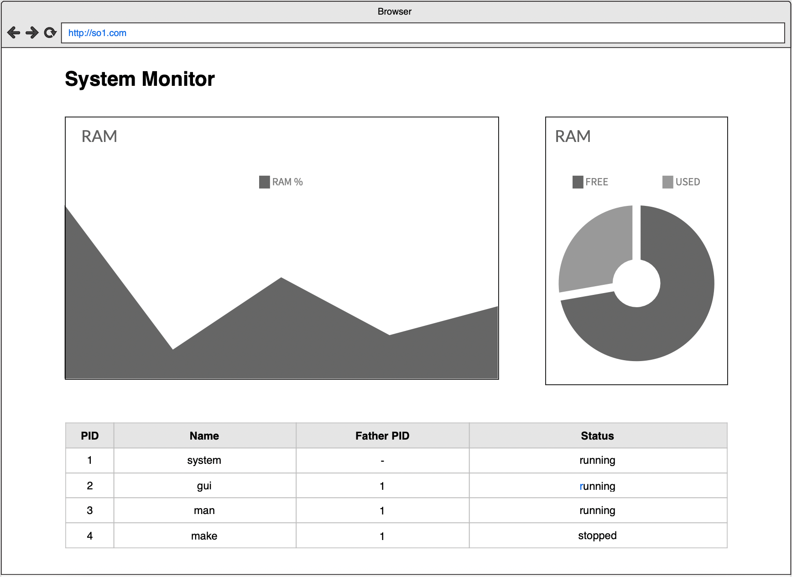

# PROYECTO 1

## DESCRIPCION

Dada la situación actual, con la pandemia COVID-19, se require hacer un análisis en tiempo real de los datos de infecciones alrededor de Guatemala. Por ello, es necesario realizar un sistema que pueda almacenar los datos de infecciones y mostrar gráficas relevantes; así tomar mejor decisiones en la búsqueda de métodos para sobrellevar la contingencia de la mejor manera.
El sistema contará con una carga masiva de datos, los cuales tendrán un formato específico detallado más adelante; además, contarán con una app web que mostrará las gráficas y métricas más relevantes de los datos que se suministren al sistema, por último, mostrará el estado de la RAM y un listado de procesos del servidor donde se almacenarán los datos.
Se utilizarán cuatro alternativas de middlewares de mensajería; cada uno de ellos será utilizado para enviar el tráfico generado en conjunto, esto con el fin de tener una respuesta más rápida al momento de cargar datos, además de utilizar tecnología de vanguardia para sobrellevar este sistema.

## Flujo general del programa

El flujo del programa se puede visualizar en el siguiente diagrama:


En el diagrama, se sigue la siguiente convención:

|                SIMBOLO                |     NOMBRE      | DESCRIPCION                                                                |
| :-----------------------------------: | :-------------: | -------------------------------------------------------------------------- |
|         | MAQUINA VIRTUAL | El recuadro donde se encuentra el símbolo es una máquina virtual distinta. |
|  | MAQUINA VIRTUAL | El servicio donde se encuentra está dentro de un contenedor docker.        |

## EXPLICACIÓN DEL FLUJO GENERAL

El sistema contará con diferentes módulos, cada uno de ellos es crucial para que el sistema funcione correctamente. Estos módulos pueden ser dividos en los tres rectángulos grises claro que se encuentran en el diagrama del flujo de la aplicación.

### LOCAL MACHINE

Los componentes en este módulo estarán guardados en una máquina local de los integrantes, estos no necesitan estar en la nube.

#### ARCHIVO DE DATOS JSON

Se deberá tener un archivo de datos JSON con el siguiente formato, donde se encontrarán los datos que se cargarán de forma masiva al sistema.
El archivo de ejemplo es:

[Archivo de ejemplo](./traffic.json)

#### LOCUST

Locust es una herramienta que permite generar tráfico de prueba, se utiliza python para configurarlo. Para más información acerca de esta herramienta, visitar la página https://locust.io/. Locust será utilizado para enviar el tráfico contenido en el archivo JSON descrito anteriormente, este enviará datos al Load Balancer (definido más adelante), el cual redireccionará el tráfico en los diferentes servicios de mensajería (definido más adelante) para finalmente ser guardados en MongoDB. Al ser guardados se debe almacenar la ruta que siguió el dato en el flujo general.

Esta herramienta facilitará la creación de un generador de tráfico, la forma de trabajar con él será:

- Generar un archivo con el nombre traffic.json que contiene todos los datos de los casos.
- El contenido de traffic.json son todos los parámetros que serán enviados aleatoriamente con cada solicitud.

Se debe configurar los parámetros de concurrencia en Locust:

- Número de usuarios totales a simular.
- Tasa de generación (usuarios generados / segundo).
- Host.

El archivo de aplicación debe llamarse _traffic.py_.

### GOOGLE CLOUD PLATFORM

#### LOAD BALANCER

Se debe configurar un Cloud Load Balancer https://cloud.google.com/load-balancing el cual recibirá todo el tráfico creado por Locust, este redireccionará el tráfico a los cuatro distintos servicios de mensajería que se deben implementar.

#### MÁQUINAS VIRTUALES

En las primeras cuatro máquinas virtuales, se tendrán diferentes intermediarios:

- Grpc
- NATS
- RabbitMQ
- Google PubSub

Cada uno tendrá la misma función, llevar el tráfico generado por locust a una API REST (definida más adelante). Cada uno de estos servicios debe estar en una máquina virtual diferente, es decir que el proyecto tendrá cuatro máquinas virtuales cada una con uno de estos servicios. Todos estos servicios deben ser utilizados completamente con contenedores Docker, como se muestra en el diagrama principal (los contenedores son los cubos celestes).

Estos contenedores deberán comunicarse a través de una red de Docker llamada con el nombre del servicio (por ejemplo, en RabbitMQ la red de docker se llamará RabbitMQ). Cada uno de estos pares de servicios deben de ser creados realizando un archivo de docker-compose, también se debe definir la red dentro de este archivo.

##### MÁQUINA VIRTUAL #1

En esta máquina virtual se tendrá un cliente de gRPC y un server de gRPC. Ambos programados en Go.

##### MÁQUINA VIRTUAL #2

En esta máquina virtual se tendrá un publisher y un subscriber NATS. Ambos programados en Go.

##### MÁQUINA VIRTUAL #3

En esta máquina virtual se tendrá un sender y receiver de RabbitMQ utilizando AMQP. Ambos programados en Go.

##### MÁQUINA VIRTUAL #4

En esta máquina virtual se tendrá un publisher y un subscriber de Google PubSub. Ambos programados en Go.

##### MÁQUINA VIRTUAL #5

En una máquina virtual (diferente a las otras cuatro utilizadas para los servicios de mensajería) se tendrán los siguientes servicios:

###### REST API

Esta API estará escrita con Javascript utilizando NodeJS. La finalidad de esta API será recolectar los datos enviados por cada uno de los servicios de mensajería, para ser procesados y almacenados en la base de datos, además, tener todas las rutas necesarias para llevar los datos a la app web (definida más adelante). Esta API debe estar dentro de un contenedor de Docker. Se debe crear un archivo Dockerfile para manejar este contenedor. Se deberá montar un volumen que contenga la carpeta /proc para leer los procesos.

###### MONGODB

Se utilizará MongoDB para almacenar todos los registros que fueron enviados desde el inicio por el generador de tráfico. Al almacenar los datos se debe almacenar la ruta que siguió el dato en el flujo general, mediante un atributo del mismo. Se debe utilizar un contenedor de Docker para utilizar MongoDB, además deberán configurar volúmenes de Docker para garantizar que los datos se almacenen de manera persistente.  
La comunicación entre el contenedor de NodeJS y MongoDB debe ser a través de una red de Docker llamada networkapi. Se deberá utilizar un archivo docker-compose para utilizar conectar estos dos contenedores.

###### MÓDULO RAM

Montar un módulo que lea la RAM del sistema. Debe documentarse completamente la creación del módulo en el manual técnico.
Este módulo debe de proveer de la siguiente información:

- Memoria RAM total (en MB)
- Memoria RAM en uso (en MB)
- Memoria RAM libre (en MB)
- Porcentaje de memoria RAM siendo utilizada.

Para validar que sea correcto, debe mostrar los mismos valores que el comando:

```bash
$ free –h
```

###### MÓDULO LISTA DE PROCESOS

Montar un módulo que lea la lista de procesos. Debe documentarse completamente la creación del módulo en el manual técnico.

- Nombre del proceso.
- PID.
- PID del padre.
- Estado.

Para validar que sea correcto, debe mostrar los mismos valores que el comando:

```bash
  $ top
```

### CLOUD RUN

#### APP WEB

Realizar una app web utilizando el framework React. Esta mostrará las diferentes métricas a partir de los datos guardados en el servidor MongoDB. Se tomará en cuenta en la calificación la aplicación de conceptos de UX/UI y de responsiveness para el diseño de la app.

##### VISTA DE MÉTRICAS

Se deberá mostrar la siguiente información:

- Tabla de datos recopilados (ordenados con el último primero) con la capacidad de filtrarse por la ruta de ingreso (Todas, NATS, gRPC, RabbitMQ o Google PubSub).
- Región más infectada; una región es una agrupación de departamentos, se tomarán en cuenta los definidos en esta página:
  https://es.wikipedia.org/wiki/Organizaci%C3%B3n_territorial_de_Guatemala#Regiones_2.
- Top 5 departamentos infectados. (Gráfica de Funnel)
- Gráfico circular del porcentaje de casos infectados por state.
- Gráfico circular del porcentaje de casos infectados por infectedType.
- Tabla con los últimos 5 casos registrados.
- Gráfico de barras del rango de edad de infectados (rangos de 10 años, por ejemplo 0..9, 10..19, etc).

##### MONITOREO DEL SERVER

Se deberá mostrar la siguiente información:

- Tabla de la lista de procesos, utilizando el módulo de procesos. (Mostrar PID, nombre, PID del padre y estado).
- Gráfico de dona del porcentaje de utilización de la RAM.
- Gráfico de polígonos de la utilización de la memoria RAM (Parecido al visor de memoria del administrador de tareas de Windows).

Cada uno de estos gráficos debe de leer los datos en tiempo real (a lo mucho tres segundos de espera entre recarga). Se pueden utilizar WebSockets, o peticiones HTTP.

**Se recomienda utilizar la siguiente librería: https://canvasjs.com/react-charts**

#### CLOUD RUN

Por último, la APP realizada en React debe ser publicada utilizando Google Cloud Run.


